# Salesforce Calendar LWC

A reusable, **SObject-agnostic** calendar for Lightning — built from small,
composable Lightning Web Components instead of one monolith.

<p align="center">
  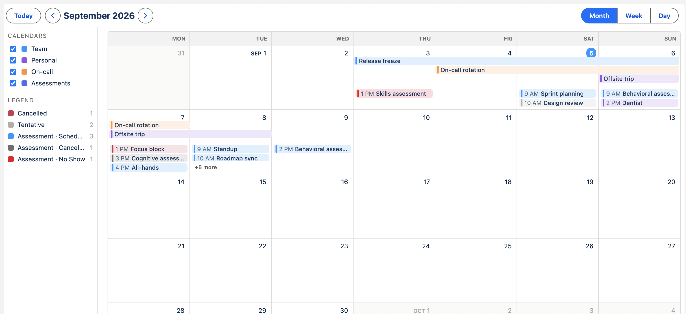
</p>

The calendar knows nothing about `Event`, `Task`, or any custom object. You feed
it a generic event shape and react to the intent events it emits. Use
**`c-cal-calendar`** with your own data, or drop in **`c-cal-workspace`** to point
it at real records with no code.

## Why

- **Composable, not a monolith** — every piece is a small single-purpose LWC;
  pure date / layout / color logic lives in `c/calCore` and is unit-tested
  directly (243 Jest tests).
- **SObject-agnostic** — a generic `{ id, title, start, end, allDay, meta }`
  shape in, `CustomEvent` intents out. Object-specific mapping happens at the
  edges.
- **Month, week, and day views** — week and day each toggle between a condensed
  agenda list and an hour-by-hour scheduler grid that packs overlapping events.
- **Calendar-wide color coding** — an ordered rule set colors every matching
  event, with a legend that updates as you navigate.
- **Config-driven event fields** — the host picks which fields render on an
  event, per view, with label and truncation options.
- **No-code SObject harness** — a `Cal_Calendar__c` record plus guided
  record-page editors map any object into the calendar. See
  [docs/harness.md](docs/harness.md).

## Screenshots

<table>
  <tr>
    <td width="50%">
      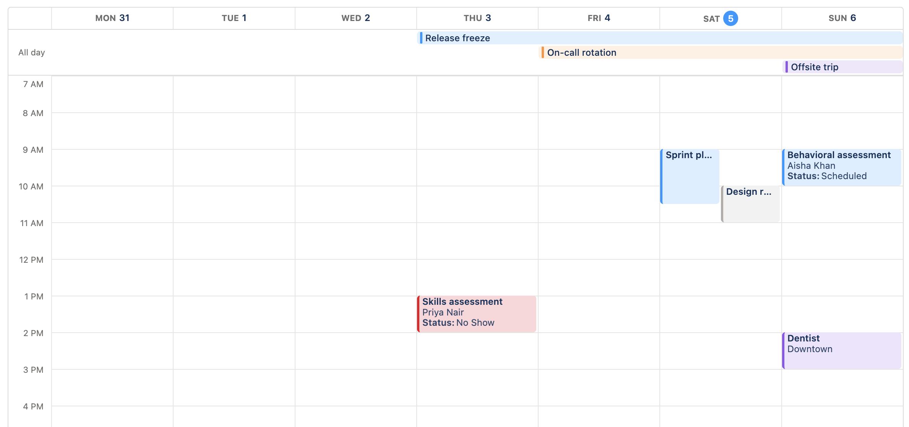
      <p><em>Week view, scheduler layout — overlapping events packed into slots.</em></p>
    </td>
    <td width="50%">
      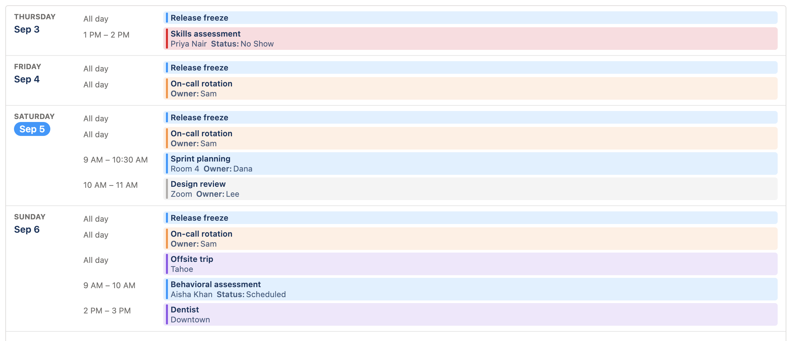
      <p><em>Condensed (agenda) layout — a chronological list per day.</em></p>
    </td>
  </tr>
  <tr>
    <td width="50%">
      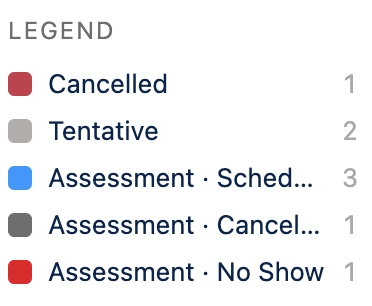
      <p><em>Calendar-wide color rules with a legend that updates as you navigate.</em></p>
    </td>
    <td width="50%">
      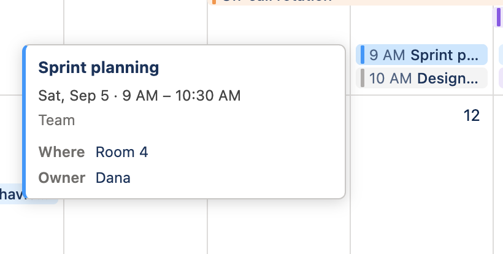
      <p><em>Read-only hover card with every configured field.</em></p>
    </td>
  </tr>
  <tr>
    <td width="50%">
      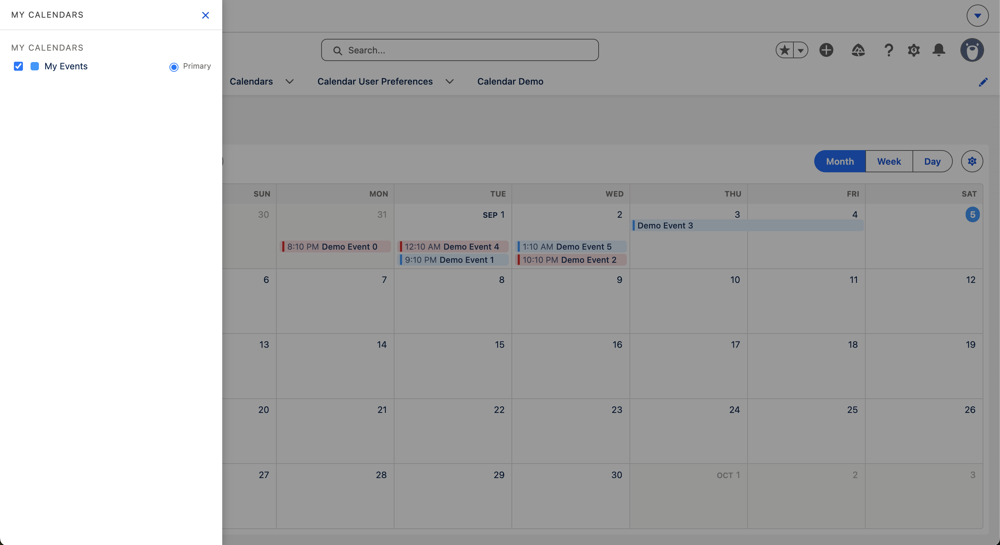
      <p><em>Workspace calendar picker drawer — My / Shared.</em></p>
    </td>
    <td width="50%">
      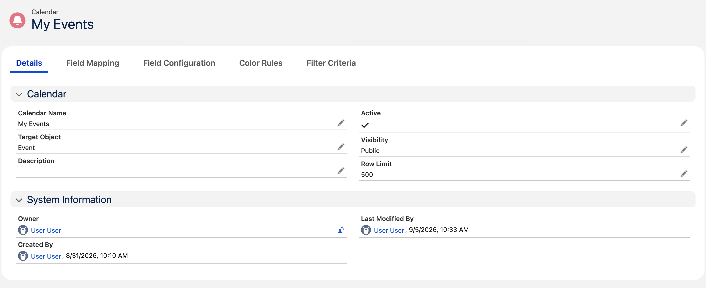
      <p><em>Calendar config — a guided editor on each tab of the <code>Cal_Calendar__c</code> record page.</em></p>
    </td>
  </tr>
</table>

## Quick start

```bash
npm install
npm test          # Jest unit tests (sfdx-lwc-jest)
npm run lint

sf org create scratch -f config/project-scratch-def.json -a calendar
sf project deploy start -d force-app
sf org assign permset -n Calendar_Access   # Calendar app + Demo / Workspace tabs
sf org assign permset -n Calendar_Admin    # harness: manage calendars, run Apex tests
sf org open -p /lightning/n/Calendar_Demo
```

- **Calendar Demo** tab (`/lightning/n/Calendar_Demo`) hosts `c-cal-demo` —
  sample data wired straight into `c-cal-calendar`, no Apex.
- **Calendar Workspace** tab (`/lightning/n/Cal_Workspace`) hosts
  `c-cal-workspace` — the SObject-backed harness. Needs `Calendar_User` or
  `Calendar_Admin` for the object and field access; `Calendar_Access` alone only
  reveals the tab.

Apex tests need the `Calendar_Admin` permission set (this scratch org enforces
FLS on Apex DML):
`sf org assign permset -n Calendar_Admin && sf apex run test -l RunLocalTests`.

## Using `c-cal-calendar`

```html
<c-cal-calendar
    events={events}
    calendars={calendars}
    view="month"
    field-config={fieldConfig}
    color-rules={colorRules}
    first-day-of-week="1"
    onrangechange={handleRangeChange}
    oneventclick={handleEventClick}
    oneventopen={handleEventOpen}
    oncalendarvisibilitychange={handleVisibilityChange}
></c-cal-calendar>
```

Event shape (all host-supplied):

```js
{ id, calendarId, title, start, end, allDay, recordId?, meta? }
```

`start` / `end` are ISO strings; `meta` is an opaque bag that `field-config` and
`color-rules` read by key. On `rangechange` the host refetches events for the new
range. A host adapter maps its records into this shape — the calendar stays
object-agnostic.

Full attribute / event / slot reference: [docs/components.md](docs/components.md).

## Using `c-cal-workspace`

Drop `c-cal-workspace` onto a Lightning App or Home page (no props). It loads the
calendars shared with the running user, lets them pick which to display via a
drawer, fetches records per visible range through Apex, and persists their view /
layout / selection. Calendars themselves are `Cal_Calendar__c` records — create
one with a Target Object and field mappings, set `Visibility__c` to `Public`, and
it appears in the picker. See [docs/harness.md](docs/harness.md).

## Configuring a calendar

Each calendar is a `Cal_Calendar__c` record. **Target Object** picks which SObject
to read; the rest is set on the record page, where each guided editor sits on its
own tab. Every editor is backed by a JSON field you can also edit raw through the
API:

- **Field Mapping** — base event fields (`title`, `start`, `end`, `allDay`,
  `recordId`) to source field API names.
- **Field Configuration** — the ordered extra fields shown on events, each with a
  source field (dotted lookup paths allowed), label, and the views it appears in.
- **Color Rules** — the calendar-wide ordered rule set plus a fallback color;
  colors are chosen from a named palette.
- **Filter Criteria** — an optional SOQL `WHERE` fragment with
  `$CURRENT_USER_ID` / `$RANGE_START` / `$RANGE_END` placeholders, syntax-checked
  on save.

<table>
  <tr>
    <td width="50%">
      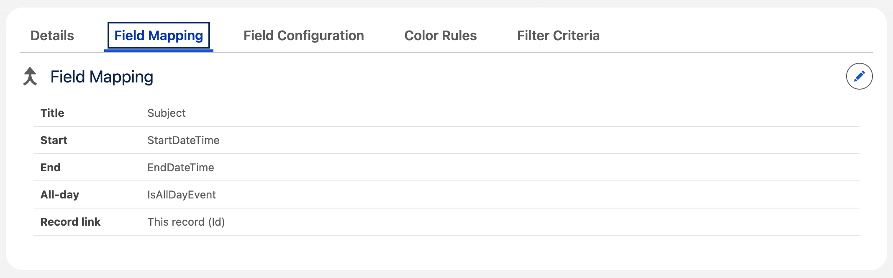
      <p><em>Field Mapping — base event fields to source field API names.</em></p>
    </td>
    <td width="50%">
      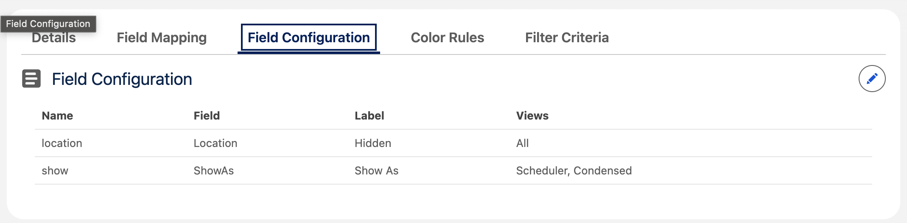
      <p><em>Field Configuration — the ordered extra fields shown on events.</em></p>
    </td>
  </tr>
  <tr>
    <td width="50%">
      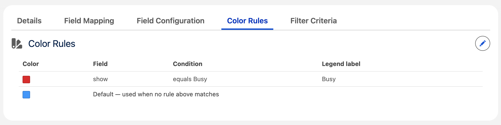
      <p><em>Color Rules — the ordered rule set and fallback color.</em></p>
    </td>
    <td width="50%">
      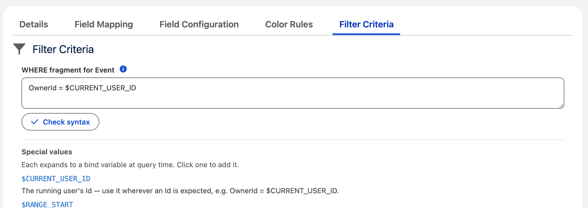
      <p><em>Filter Criteria — the SOQL <code>WHERE</code> fragment, syntax-checked on save.</em></p>
    </td>
  </tr>
</table>

A save-time trigger rejects a record whose mappings, fields, color-rule keys, or
filter don't validate, so a broken calendar never reaches the runtime query.
Display chrome (view, layout, first day of week, scheduler hours) is per-user, not
stored on the calendar. Full field reference: [docs/harness.md](docs/harness.md).

## How it works

Small, single-purpose components are composed into the calendar — most are
presentational, with data access confined to a few containers. Pure date, layout,
and color logic lives in the `c/calCore` module and is unit-tested directly. The
SObject harness follows a layered Apex path — `CalWorkspaceController` (marshalling)
→ `CalWorkspaceService` (orchestration) → selector / domain classes — so a broken
calendar definition never reaches the runtime query. See [CLAUDE.md](CLAUDE.md).

## Documentation

- [docs/requirements.md](docs/requirements.md) — functional spec
- [docs/components.md](docs/components.md) — component map + `c-cal-calendar` API
- [docs/harness.md](docs/harness.md) — the `Cal_Calendar__c` object and Apex path
- [CLAUDE.md](CLAUDE.md) — architecture principles

## License

[MIT](LICENSE) © 2026 Joshua Duchamp